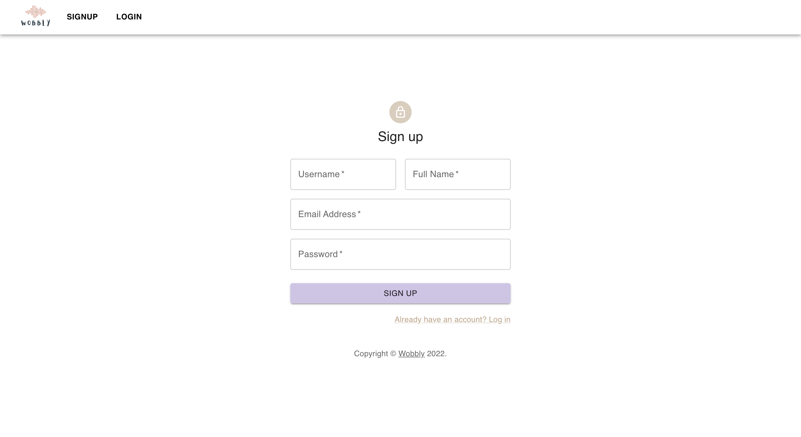
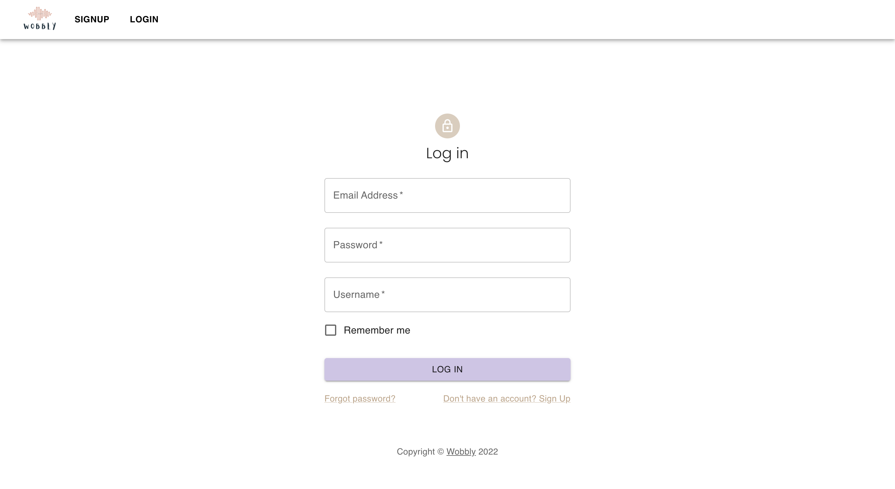

# Wobbly

A full stack MERN Application for festival lovers

## Acknowledgements

 - Ironhack
 

## Authors

- [@michaelhodgkins](https://github.com/michaelhodgkins)
- [@hsinjuyu](https://github.com/ci6803)
- [@adamamata](https://github.com/adamamata)

## Demo

https://wobbly-festivals.netlify.app

## Features

:ferris_wheel: CRUD
:ferris_wheel: Cloudinary
:ferris_wheel: Nodemailer 
:ferris_wheel: Daily 
:ferris_wheel: Favourites 
:ferris_wheel: Comments 
:ferris_wheel: Profile page 

## Screenshots

<h3>Signup Page</h3>   
  <h3>Login Page</h3>   
   <h3>Landing Page</h3>   
   <h3 align="center">Profile Page</h3>  
   <h3 align="center">Festivals Page</h3>  

## :computer: Technologies Used

